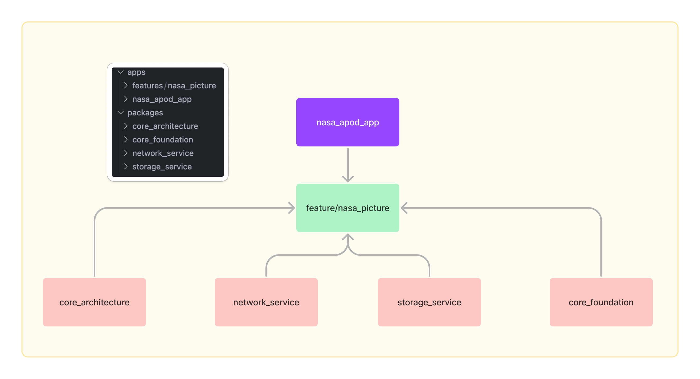
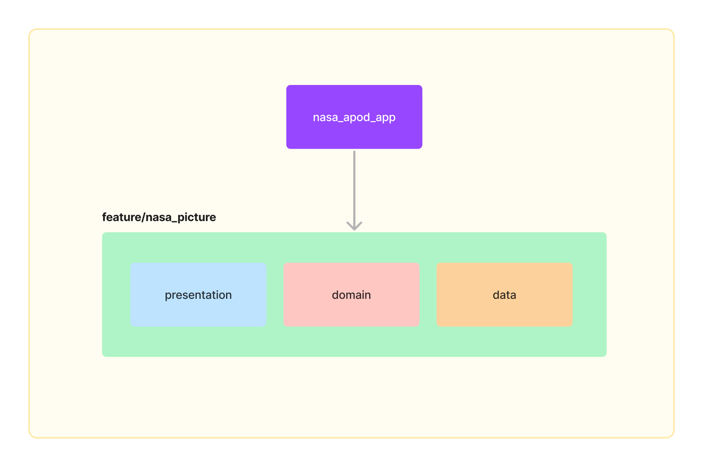
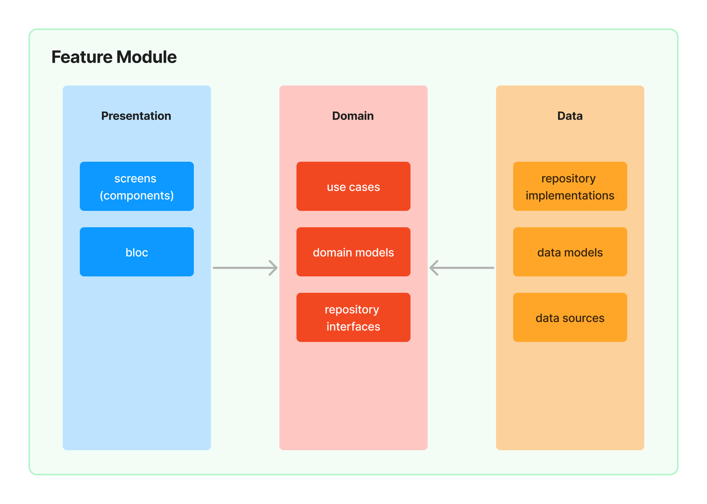

# NASA - Astronomy Picture of the Day App

Astronomy Picture of the Day App is a flutter project built using the best practices of modern software methodologies and architecture.

## Application Scope

The Astronomy Picture of the Day App is a simple application that retrieves data from [NASA API](https://api.nasa.gov/) (click Browse APIs and check APOD) and shows a gallery with a detail screen.

## Tech-Stack

This project takes advantage of best practices and many popular libraries and tools in the Flutter
ecosystem.

* Tech-stack
    * [100% Dart](https://dart.dev/)
        + [rxdart](https://pub.dev/packages/rxdart) - dart reactive apis for async programming
        + [collection](https://pub.dev/packages/collection) - collection utilities functions
        + [intl](https://pub.dev/packages/intl) - locale dates and numbers
    * [hive](https://pub.dev/packages/hive) - powerful and lightweight key-value database
    * [dio](https://pub.dev/packages/dio) - http networking package
* UI
    * [flutter_bloc](https://pub.dev/packages/flutter_bloc) - state management
    * [go_router](https://pub.dev/packages/go_router) - routing package for navigation-related actions
    * [cached_network_image](https://pub.dev/packages/cached_network_image) - load and cache network images
* Infra
    * [melos](https://pub.dev/packages/melos) - multi-package helper CLI tool
    * [fvm](https://fvm.app/) - flutter version management
    * [get_it](https://pub.dev/packages/get_it) - dependency injection
    * [build_runner](https://pub.dev/packages/build_runner) - dart code generation
    * [freezed](https://pub.dev/packages/freezed) - immutable and sealed objects
    * [json_serializable](https://pub.dev/packages/json_serializable) - parse [JSON](https://www.json.org/json-en.html)
* Tests
    * [flutter_test](https://api.flutter.dev/flutter/flutter_test/flutter_test-library.html) - testing library for flutter packages
    * [test](https://pub.dev/packages/test) - testing library for dart packages
    * [mockito](https://pub.dev/packages/mockito) - mocking framework

## Architecture

By dividing a problem into smaller and easier-to-solve sub-problems, we can reduce the complexity of
designing and maintaining a large system. Each module is an independent build block serving a clear purpose. We can think about each feature as a reusable component, the equivalent of [microservice](https://en.wikipedia.org/wiki/Microservices) or private library.

The modularized code-base approach provides a few benefits:

- reusability - enable code sharing and building multiple apps from the same foundation. Apps should be a sum of their features where the features are organized as separate modules.
- [separation of concerns](https://en.wikipedia.org/wiki/Separation_of_concerns) - each module has a clear API. Feature-related classes live in different modules and can't be referenced without explicit module dependency. We strictly control what is exposed to other parts of your codebase.
- features can be developed in parallel eg. by different teams
- each feature can be developed in isolation, independently from other features
- faster build time

### Module Types And Dependencies

We have 2 kinds of modules in the application:

- `apps` module - represents the main app or a feature. It contains code that wires multiple modules together (class, dependency injection setup, navigation, etc.) and fundamental application architecture (data, domain and presentation layer).
- `packages` modules - represents shareable and reusable code

### Feature Module Structure

`Clean Architecture` is implemented at the feature level - each feature module contains its own set of Clean
Architecture layers:

> Notice that all the `packages` modules structure differs a bit from the feature module structure.

Each feature module contains non-layer components and 3 layers with a distinct set of
responsibilities.

#### Presentation Layer

This layer is closest to what the user sees on the screen. The `presentation` layer uses [Flutter Bloc](https://pub.dev/packages/flutter_bloc) as state management approach.

#### Domain Layer

This is the core layer of the module. Notice that the `domain` layer is independent of any
other layers. This allows making domain models and business logic independent from other layers. In
other words, changes in other layers will not affect the `domain` layer eg. changing the database (`data` layer) or screen UI (`presentation` layer) ideally will not result in any code change within the `domain`
layer.

#### Data Layer

Encapsulates application data. Provides the data to the `domain` layer eg. retrieves data from
datasource (internet or local cache).

## Pagination and Search Engine

Pagination and Search engines are both easy-to-use and shareable structures that adds important capabilities to the project.

Search engine is based on `Filterable` interface. Every `Filterable` object can be filtered through `FilterMatcher` with simple or complex rules.

Pagination engine uses `PageDocument` to retrieve paginated data from `PaginationSource`. It could be used with data from local or remote.